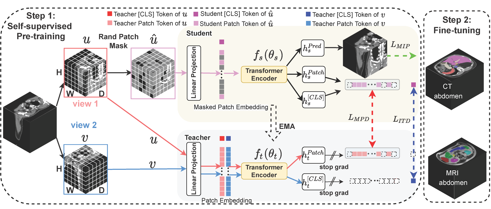

<!-- ABOUT THE PROJECT -->
## About The Project


 Self-supervised 3D anatomy segmentation using self-distilled masked image transformer (SMIT). SMIT used both global, patch and pixel level information for self-supervised learning in self-distillization manner. 
 
 <div align="center">
  
</div>


 ## Jue Jiang, ... Harini Veeraraghavan

This is the official source code for the MICCAI 2022 paper [SMIT](https://link.springer.com/chapter/10.1007/978-3-031-16440-8_53)


<!-- GETTING STARTED -->
## Getting Started


### Install
pip install requirements.txt


<!-- USAGE EXAMPLES -->
## Usage

## for self supervised pretraining
python train_self_supervised.py


## for fine tuning
python fine_tuning_swin_3D.py  --resume_ckpt

<!-- ACKNOWLEDGMENTS -->
## Our code refered the following implementation

* [UNETR](https://github.com/Project-MONAI/research-contributions/tree/main/UNETR)
* [ibot](https://github.com/bytedance/ibot)

<!-- Citation -->

## Citing SMIT
If you find this repository useful, please consider giving a star :star: and citation:
```
@InProceedings{juejsmit,
  title={Self-supervised 3D Anatomy Segmentation Using Self-distilled Masked Image Transformer (SMIT)},
  author={Jiang, Jue and Tyagi, Neelam and Tringale, Kathryn and Crane, Christopher and Veeraraghavan, Harini},
  journal={International Conference Medical Image Computing and Computer Assisted Intervention, 2022},
  pages={556--566},
  DOI={DOI: 10.1007/978-3-031-16440-8_53},
  year={2022}
}
```

<p align="right">(<a href="#readme-top">back to top</a>)</p>


